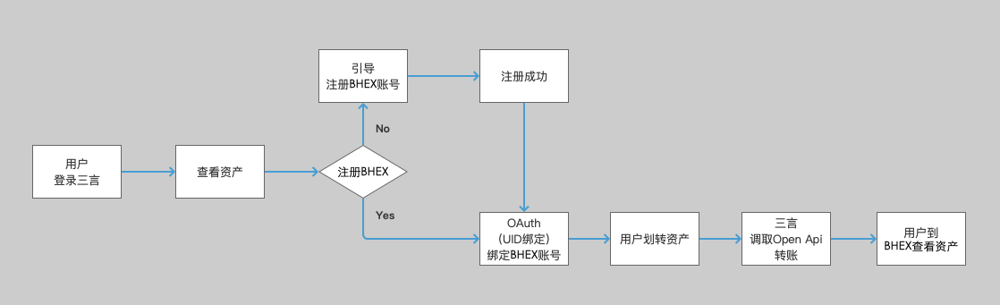
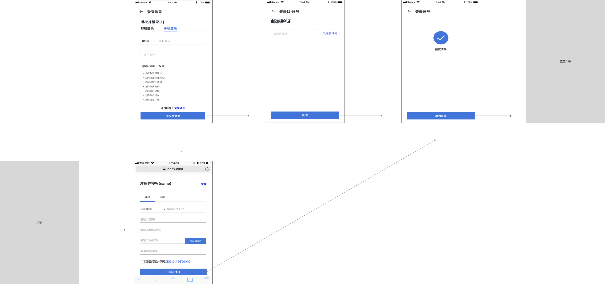

# OAuth API

## 使用场景

### 外部 app 提币到交易所去卖

- 1，外部 app 使用 oauth2 接口，引导需要提币的用户绑定交易所账号，获得交易所 uid；
- 2，外部 app 的运营方在交易所注册一个账号，加白名单（目前是走邮件模式）后，获得 openapi 接口空投权限；
- 3，外部 app 运营方往自己的交易所账户充币；
- 4，用户在外部 app 点击一键提币的时候，外部 app 扣减用户的余额，在交易所这边，外部 app 运营方调用 openapi 接口，往用户绑定的交易所 uid 上空投对应数量的币

### 样例

三言（新闻媒体app）用户提币 yant （三言app内的积分映射的币）到 wallex 去卖



### OAuth 在第三方 app 中的使用流程

- 第三方 app 中在合适位置（建议个人中心）放置“绑定交易所账户” 按钮
- 用户点击按钮，打开交易所 oauth 登录授权页面
- 用户在交易所登录授权页面上填写交易所用户名密码，登录，并点击授权按钮
- 交易所授权页面跳转到 oauth app 登记的 return url （返回的 url）上（第三方 app 自己开发的 h5 页面）
- 第三方在 return url 所在的 h5 页面上，引导用户回到 app （或者直接回到 app）



## 接口描述

### OAuth 本身认证 endpoint

#### 1、获取Authorization Code[打开授权页面，成功授权后，回调信息会带上Authorization Code]

* 请求地址：GET /m/oauth
* 请求参数

    | 参数          | 类型   | 是否必填 | 描述                                                                                                                                                                                                                                                                                                                                                              | 备注 |
    | :------------ | :----- | :------- | :---------------------------------------------------------------------------------------------------------------------------------------------------------------------------------------------------------------------------------------------------------------------------------------------------------------------------------------------------------------- | :--- |
    | responseType | string | 必填     | 授权类型，此值固定为“code”                                                                                                                                                                                                                                                                                                                                        |      |
    | appId         | string | 必填     | 申请成功后，分配给应用的appid                                                                                                                                                                                                                                                                                                                                     |      |
    | redirectUri  | string | 必填     | 成功授权后的回调地址，必须是注册appid时填写的主域名下的地址，建议设置为网站首页或网站的用户中心。<br>注意需要将url进行URLEncode。                                                                                                                                                                                                                                 |      |
    | state         | string | 必填     | client端的状态值。用于第三方应用防止CSRF攻击，成功授权后回调时会原样带回。<br>请务必严格按照流程检查用户与state参数状态的绑定。                                                                                                                                                                                                                                   |      |
    | scope         | string | 选填     | 请求用户授权时向用户显示的可进行授权的列表。<br>可填写的值是API文档中列出的接口，以及一些动作型的授权（目前仅有：get_user_info），如果要填写多个接口名称，请用逗号隔开。<br>例如：scope=get_user_info,get_balance_info<br>不传则默认请求对接口get_user_info进行授权。<br>建议控制授权项的数量，只传入必要的接口名称，因为授权项越多，用户越可能拒绝进行任何授权。 |      |

* 授权成功回调数据

    | 参数    | 类型   | 描述                                                                                                                 | 备注     |
    | :------ | :----- | :------------------------------------------------------------------------------------------------------------------- | :------- |
    | code    | string | 用户获取access_token的授权码 <br>如果用户成功登录并授权，则会跳转到指定的回调地址，并在URL中带上Authorization Code。 |          |
    | expired | long   | code失效时间                                                                                                         | 单位毫秒 |
    | state   | string | request中的状态值                                                                                                    | 原样返回 |

* 回调url

    https://xxx?code=9A5F*******06AF&expired=1531987777000&state=test

#### 2、通过Authorization Code获取Access Token

* 接口地址： POST /api/v2/oauth2/token

* 请求参数

    | 参数          | 类型   | 是否必填 | 描述                                               | 备注                         |
    | :------------ | :----- | :------- | :------------------------------------------------- | :--------------------------- |
    | grant_type    | string | 必填     | 授权类型，在本步骤中，此值为“authorization_code”   |                              |
    | client_id     | string | 必填     | 申请成功后，分配给应用的appid                      |                              |
    | client_secret | string | 必填     | 申请成功后，分配给应用的appsecret                  | 将分配的appsecret使用md5加密 |
    | code          | string | 必填     | 上一步返回的authorization code。注意code的失效时间 |                              |

* 返回数据

```JSON
{
    "status":0,
    "data":{
        "accessToken":"8rPpqfKIB******t64kQ",
        "expired":"1567219794582",
        "openId":"2144a5e0459234c8ef03e2acd4291d1a",
        "userId":"83214971450163200"
    }
}
```

#### 3、（可选）权限自动续期，获取Access Token[暂未实现]


### 授权使用 API

OAuth 授权流程走完后，第三方服务器端会拿到一个我们给的 `accessToken` 。第三方服务器端拿着这个 accessToken 来调用我们下面的接口。接口参数里不需要 uid 字段

#### 1） 获取用户信息

* 所需权限 get_user_info
* 接口地址 POST /api/v2/oauth2/user/get_user_info

* 请求参数

    | 参数         | 类型   | 是否必填 | 描述                                              | 备注 |
    | :----------- | :----- | :------- | :------------------------------------------------ | :--- |
    | client_id    | string | 必填     | 申请成功后，分配给应用的appid                     |      |
    | access_token | string | 必填     | 授权成功后获取的accessToken                       |
    | open_id      | string | 必填     | 获取accessToken成功后返回的openId，和用户一一对应 |      |

* 返回数据

```JSON
{
    "status":0,
    "data":{
        "userId":"83214971450163200",
        "registerType":1, // 注册方式 1 手机号注册 2 邮箱注册
        "mobile":"15100001111", // 手机号
        "nationalCode":"86", // 手机号对应的国际区号
        "email":"yami@qq.com", // 邮箱
        "bindGA":true, // 是否绑定GA
        "bindTradePwd":true, // 是否绑定资金密码
        "verifyStatus":2, // kyc状态 1 审核中 2 审核通过 3 审核不通过
        "registerDate":"1534575995865" // 注册时间
    }
}
```
#### 2） 获取资产信息

* 所需权限 get_balance_info
* 接口地址 POST /api/v2/oauth2/user/get_balance_info

* 请求参数

    | 参数         | 类型   | 是否必填 | 描述                                              | 备注 |
    | :----------- | :----- | :------- | :------------------------------------------------ | :--- |
    | client_id    | string | 必填     | 申请成功后，分配给应用的appid                     |      |
    | access_token | string | 必填     | 授权成功后获取的accessToken                       |
    | open_id      | string | 必填     | 获取accessToken成功后返回的openId，和用户一一对应 |      |

* 返回数据

```JSON
{
    "status":0,
    "data":[
        {
            "tokenId":"BTC",
            "tokenName":"BTC",
            "total":"379.624059937852365", // 总共
            "free":"266.319059937852365", // 可用
            "locked":"113.305", // 冻结 == 下单冻结 + 锁仓
            "btcValue":"379.624059937852365", // 资产BTC估值
            "usdtValue":"3354821.3349639876770253", // 资产USDT估值
            "position":"45", // 锁仓金额
            "balanceCreatedAt":"1551424140313",
            "balanceUpdatedAt":"1579182385290"
        },
        {
            "tokenId":"ETH",
            "tokenName":"ETH",
            "total":"9979.99455031",
            "free":"9978.7",
            "locked":"1.29455031",
            "btcValue":"328.15220080874311",
            "usdtValue":"1696599.0735527",
            "position":"1.29455031",
            "balanceCreatedAt":"1546432260461",
            "balanceUpdatedAt":"1573835817728"
        },
        {
            "tokenId":"USDT",
            "tokenName":"USDT",
            "total":"918662.0917630848",
            "free":"678866.1505742048",
            "locked":"239795.94118888",
            "btcValue":"103.955802303910675968",
            "usdtValue":"918662.0917630848",
            "position":"108",
            "balanceCreatedAt":"1551424200065",
            "balanceUpdatedAt":"1578640809193"
        }
    ]
}
```