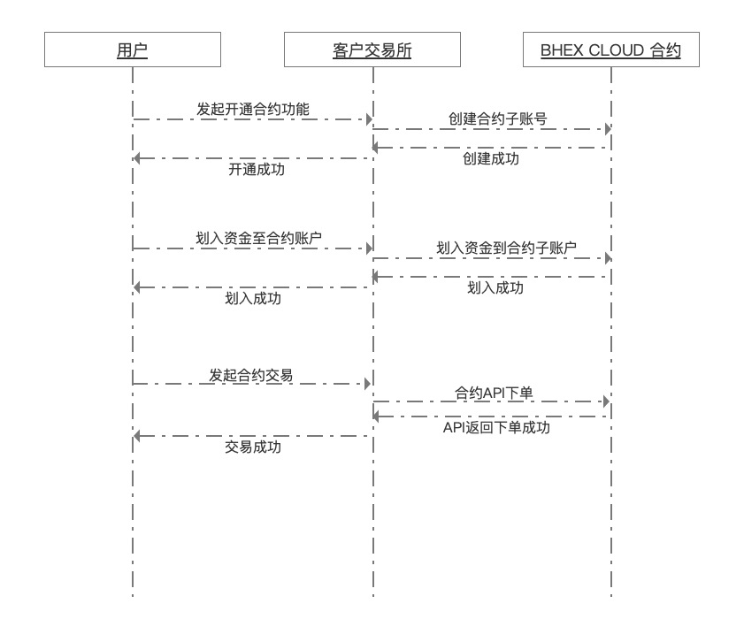

# wallex Cloud 合约云接入文档

## 1. 概述

此文档概述了外部客户接入wallex Cloud 合约云的的方式。

开通wallex Cloud 的SAAS云券商服务，使用主子账户功能接入合约交易。

备注：为了方便与客户原有系统的用户体系打通，保持概念一致。接口实现上采用“虚拟用户”的描述，即为每一个客户原系统的用户，分配一个wallex Cloud 券商用户 uid，而不仅仅是 account id 。这个 uid 同样可以绑定多个不同用户的子账户。

[wallex Cloud 子账户体系说明](subaccount.md)

优势：无需在wallex Cloud 开单独交易所，适用于已有交易所客户，不改造自有用户体系，账户、钱包充提都不变，快速对接上线合约交易功能。客户需要定制开发前端（提供前端Demo源码）。

wallex官网：<https://www.wallex.one/>

wallex Cloud官网：<https://www.bluehelix.cloud/>

## 2. 对接流程说明

### 2.1 流程概述

1. 签订商务合同，确定技术对接方式，对接时间
2. 对接合作群聊建立，双方技术入场
3. 技术对接，含后端+前端（Web、APP）
4. 在测试环境下进行系统测试
5. 通过测试，上线部署正式环境
6. 上线后的系统运维及数据统计报表支持

### 2.2 终端用户合约交易流程示意

### 2.3 技术对接流程

#### 部署工作

1. 客户原有网站 Web/H5/App 原有域名（abc.com）保持不动
2. 客户在 wallex Cloud 开通一个券商，绑定一个域名（xyz.com），注册一个前台用户，绑定为运营账户，并向运营账户充值备付金
3. 客户使用 wallex cloud 的 Web/H5/App 源码，二次开发修改样式，微调功能细节后，部署在客户自己服务器 nginx上。配置单独的合约子域名（swap.abc.com or dm.abc.com），指向合约服务。
4. 提供单独合约子域名（swap.abc.com or dm.abc.com）的 SSL 证书给 wallex Cloud 作为 upstream 配置使用

#### 用户操作流程

1. 未登录用户使用合约服务 web 或 app，指向客户自己的 nginx （dm.abc.com）。前端访问行情接口(dm.abc.com/api 经客户 Nginx 代理到 wallex Cloud 的 upstream)获取合约的 K线、盘口、最新成交数据，显示在页面上
   1. 用户登录原有网站 abc.com ，如果是用户第一次使用合约功能，客户server调用 wallex Cloud OpenAPI 为用户注册一个 xyz.com 的虚拟用户uid，并绑定
   2. 用户登录原有网站 abc.com ，客户server调用 OpenAPI 登录功能，获取虚拟用户uid的登录 auth token，并种到前端cookie里（web或app, 建议种在 .abc.com 根域名下）
2. 用户在页面上操作划转资金：从原系统的钱包划转资产到合约钱包。页面调用客户自定义 api server（dm.abc.com/myapi），执行划转动作
   1. 客户server调用 OpenAPI 转账功能，从运营账号向为用户绑定的虚拟用户uid转账
   2. 客户server内部扣减用户在原有系统中的余额
   3. 从合约钱包划账回原系统钱包，反向操作即可：客户server调用 OpenAPI 转账功能，从为用户绑定的虚拟用户uid向运营账号转账；原系统中为用户增加余额
   4. 在前端显示用户在合约系统中的可用余额（对应原系统的钱包资产已经减少）
3. 已登录用户在合约界面上下单，页面请求 wallex Cloud 的 user api 接口（dm.abc.com/api 代理到 upstream）
4. 前端访问 wallex Cloud 的 user api 接口（dm.abc.com/api 代理到 upstream）获取持仓、订单信息
5. 前端订阅 websocket 推送，直接连到 wallex Cloud 的 user api 接口 (dm.abc.com/ws 代理到 upstream)
6. 客户提供回调接口 dm.abc.om/callback ，接收实时消息通知（用户爆仓提醒等），并处理（给用户发短信）

### 2.4 接口文档

[合约云对接接口文档](../openapi/cloud_api.md)
