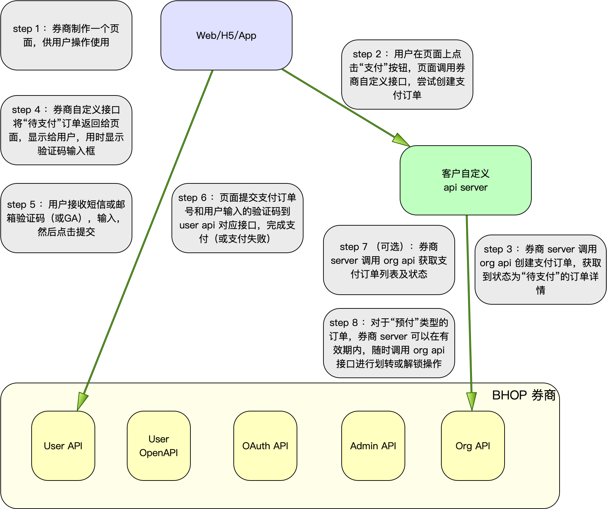

# 支付接口

## 说明

为了避免二次开发过程中操作用户资产的风险，现将 org api 中的 transfer 转账接口升级为 pay 支付接口

## 流程

### 准备工作（配置）

- 客户在券商管理后台申请开通 org api 支付功能
- 平台审核通过后，开通功能
- 客户在券商管理后台绑定支付结果回调 api 地址 （二期支持）

### 标准调用流程

- 二次开发功能页面（活动或其他功能），提供用户操作
- 用户登录后，进入功能页面，点击支付按钮（根据业务需要可能有输入框输入支付币种、数量）
- 功能页面提交请求到二次开发的 api server
- 二次开发功能的 api server 调用 org api，创建付款订单，包括以下信息
  - client order id
  - 收款人信息（用来显示在用户支付页面上）
  - 付款标的 id （5 - 12 个英文字符、数字、下划线组成的 id，后面可以用这个 id 查询所有相关付款。类似活动 id）
  - 付款理由（用来显示在用户支付页面上，建议填写活动名称文本，注意多语言适配）
  - 付款订单类型：直接划扣，预扣，映射（下期支持）
  - from uid （account id）
  - to uid （account id）
  - 支付币种及对应数量（数组，可以在一笔订单中支付不同数量的不同币种）
  - 获得币种及对应数量（数组，仅映射有效，下期支持）
  - 其它 meta 信息：预扣有效期，用户 user agent，用户端 ip 等风控需要的参数
- org api 返回付款订单给 api server，包括以下信息
  - 订单号
  - 订单有效期（过期未支付则失效）
  - 二次验证方式（手机验证码，邮箱验证码，GA，资金密码，选一种）
  - 上面传入的订单详情
- 功能页面拿到付款订单，弹框显示在页面上（app，h5，或web），同时显示用户 2fa 输入框（这个地方弹框建议使用平台提供的sdk，以确保订单信息显示的真实和有效性，并降低开发工作量）
- 用户输入 2fa 信息，点击弹框上的“支付”按钮，页面提交订单号和 2fa 信息到 user api
- user api 验证订单号有效，2fa 有效，用户支付成功；否则支付失败（单个订单支付 3 次失败则失效；订单10分钟内未支付则失效）
- user api 回调二次开发的 api server 的回调接口，通知二次开发 api server 用户支付结果（成功或失败）
- （仅预扣需要）客户根据业务需要，在预扣有效期内，用订单号作为参数，调用 org api 的 “预扣订单处理” 接口，将用户预扣的币种及数量部分或全部扣除，或解锁。管理后台也要支持操作。
- 退款流程：用户（线下或其它联系渠道）找券商沟通，券商管理员*跟收款方*确认后，管理后台通过订单号（或 client order id）搜索订单，操作退款；或者 org api 用订单号（或 client order id）做参数调用退款接口退款

### 便捷调用流程 （二期支持）

- 二次开发功能页面（活动或其他功能），提供用户操作
- 用户登录后，进入功能页面，点击支付按钮（根据业务需要可能有输入框输入支付币种、数量）
- 功能页面提交请求到 user api 创建付款订单，包括以下信息
  - client order id
  - ~~收款人信息（用来显示在用户支付页面上）~~ 不接收页面提交的收款人，默认为券商运营账户
  - 付款标的 id （5 - 12 个英文字符、数字、下划线组成的 id，后面可以用这个 id 查询所有相关付款。类似活动 id）
  - 付款理由（用来显示在用户支付页面上，建议填写活动名称文本，注意多语言适配）
  - 付款订单类型：直接划扣，预扣，映射（下期支持）
  - from uid （account id）
  - to uid （account id）
  - 支付币种及对应数量（数组，可以在一笔订单中支付不同数量的不同币种）
  - 获得币种及对应数量（数组，仅映射有效，下期支持）
  - 其它 meta 信息：预扣有效期，用户 user agent，用户端 ip 等风控需要的参数
- user api 返回付款订单给页面，包括以下信息
  - 订单号
  - 订单有效期（过期未支付则失效）
  - 二次验证方式（手机验证码，邮箱验证码，GA，资金密码，选一种）
  - 上面传入的订单详情
- 功能页面拿到付款订单，弹框显示在页面上（app，h5，或web），同时显示用户 2fa 输入框（这个地方弹框建议使用平台提供的sdk，以确保订单信息显示的真实和有效性，并降低开发工作量）
- 用户输入 2fa 信息，点击弹框上的“支付”按钮，页面提交订单号和 2fa 信息到 user api
- user api 验证订单号有效，2fa 有效，用户支付成功；否则支付失败（单个订单支付 3 次失败则失效；订单10分钟内未支付则失效）
- user api 回调二次开发的 api server 的回调接口，通知二次开发 api server 用户支付结果（成功或失败）
- （仅预扣需要）客户根据业务需要，在预扣有效期内，用订单号作为参数，调用 org api 的 “预扣订单处理” 接口，将用户预扣的币种及数量部分或全部扣除，或解锁。管理后台也要支持操作。
- 退款流程：用户（线下或其它联系渠道）找券商沟通，券商管理员确认后，管理后台通过订单号（或 client order id + 付款标的 id）搜索订单，操作退款；或者 org api 用订单号（或 client order id + 付款标的 id）做参数调用退款接口退款

### 标准流程跟便捷流程的差异

- 便捷流程只能支付给券商运营，优点是不需要 org api 参与，直接在页面上完成所有操作
- 标准流程可以向任意指定的用户支付。标准流程支付后的退款，需要征得收款方同意才行

### 接口约束

- client order id + 付款标的 id = 唯一键约束

## 接口定义 TODO

### org api 中的接口定义

[org api 中的接口定义](org_api.md#7-支付相关接口)

### user api 中的接口定义

[user api 中的接口定义](../UserAPI/支付.md)
