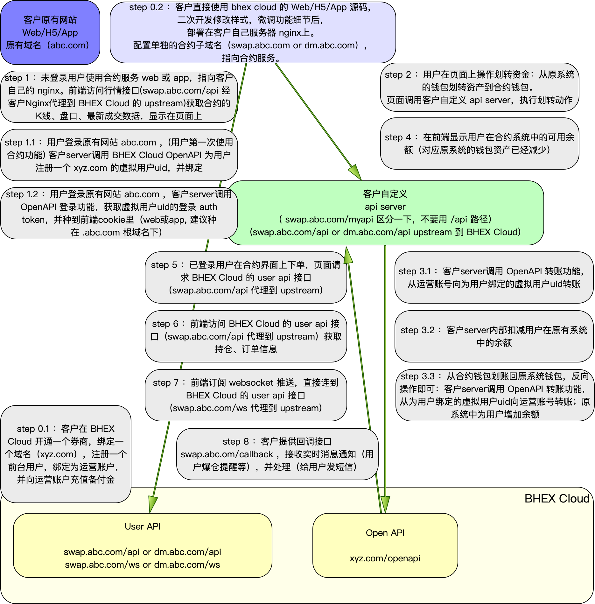
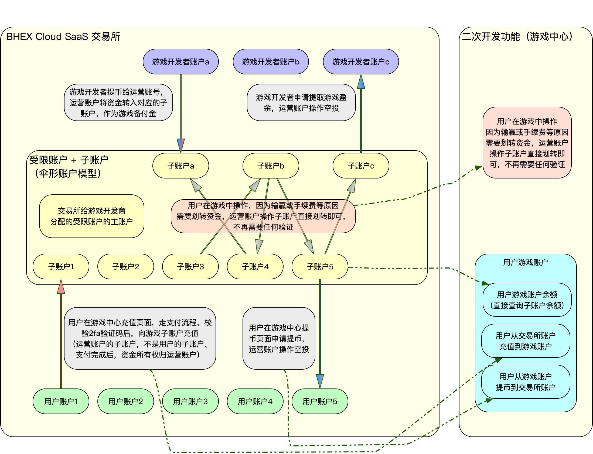

# BHEX Cloud 用户子账户体系

## 说明

在 BHEX Cloud 体系里，用户(User) 是券商层的概念，每个用户附带邮箱、手机号、登录密码、KYC 信息等属性，每个用户拥有多个账户(Account) 。账户类型包括：现货账户，合约账户，期权账户，杠杆账户等。系统为每个用户开通了一个默认现货账户（也可称为主账户，可以支持充提币，OTC交易，币币交易业务等）。如果券商开通了合约、期权、杠杆等业务，那么券商的用户会自动开通相应的账户。

另外，用户可以开通额外的账户（各种类型），称为子账户，用来支持系统各种功能。

## 接口文档

// todo

## 限制

每个用户开通的子账户数量技术上并无严格限制。但为了防止滥用，普通用户限制开通 5 个子账户。特殊用户可支持到 1000个子账户。如果需要提升限额，请联系 bhex cloud 商务提交工单。

## 典型使用方式

### 1）用户自己开一个子账户，做独立记账使用

子账户不能充提币，不能 otc 交易。

web 和 app 上不提供子账户交易功能，只能用 openapi 进行交易。每一种类型的子账户，都限定只能执行该类型允许的交易操作。

子账户使用单独的 openapi 的 api key 和 api secret 进行操作，在 web 上能查看子账户资金流水、订单、成交明细等，以及操作主账户和子账户之间的资金划转。

### 2）外部交易所对接 bhex cloud 券商的合约功能（合约云）

客户在 bhex cloud 开通一个券商，注册一个账户，绑定为券商的运营账户。在运营账户下用子账户功能实现一个伞形账户体系进行 api 操作。

备注：为了方便与客户原有系统的用户体系打通，保持概念一致。接口实现上采用“虚拟用户”的描述，即为每一个客户原系统的用户，分配一个BHEX Cloud 券商用户 uid，而不仅仅是 account id 。这个 uid 同样可以绑定多个不同用户的子账户。

[BHEX Cloud 合约云接入流程说明](contract_cloud.md)

[BHEX Cloud 合约云接入接口文档](../openapi/cloud_api.md)

### 3）bhex cloud 券商对接外部游戏开发商

要点：

- 券商拥有一组专用受限用户，控制权为券商所有，每个受限用户对应一个游戏开发商
- 受限用户不能在 Web 或 App 上登录或者使用，只能通过 API 操作
- 受限用户可建立多个子账户，每个子账户对应一个游戏用户及相应资产

步骤：

- 券商为每个游戏开发商创建一个专属受限用户，券商拥有此受限用户的全部控制权。每个开发商可以开发上架多个游戏。
- 在受限用户下的主账户，代表游戏开发商的权益
- 在受限用户下的其他子账户，代表相应的游戏用户，用来做实时的游戏结算
- （可选）游戏开发商向受限用户的主账户支付作为备付金
- 券商开发一个单独的游戏充值页面，供用户使用。用户在页面上操作，使用支付功能，验证用户的验证码后，将资金划入相应的子账户（支付完成后，所有后续的游戏结算，可用子账户之间的划转功能，也就不用再验证用户的验证码了）
- 用户玩游戏，根据游戏结果，券商调用 OpenAPI 中的子账户划转接口，在受限用户的主账户和相应子账户之间划转资金（记得妥善处理资金不够的情况）
- 游戏开发商结算：根据需要，券商调用 OrgAPI 的空投接口，将受限用户主账户的资金，“空投”给游戏开发商自己注册的账号。开发商可以自由操作自己注册账号中的资金（提币，交易等）
- 用户结算：券商开发一个游戏提币页面，供用户使用。用户在页面上操作，券商调用 OrgAPI 的空投接口，将绑定的用户子账户中的资金，“空投”给用户自己的账号。

