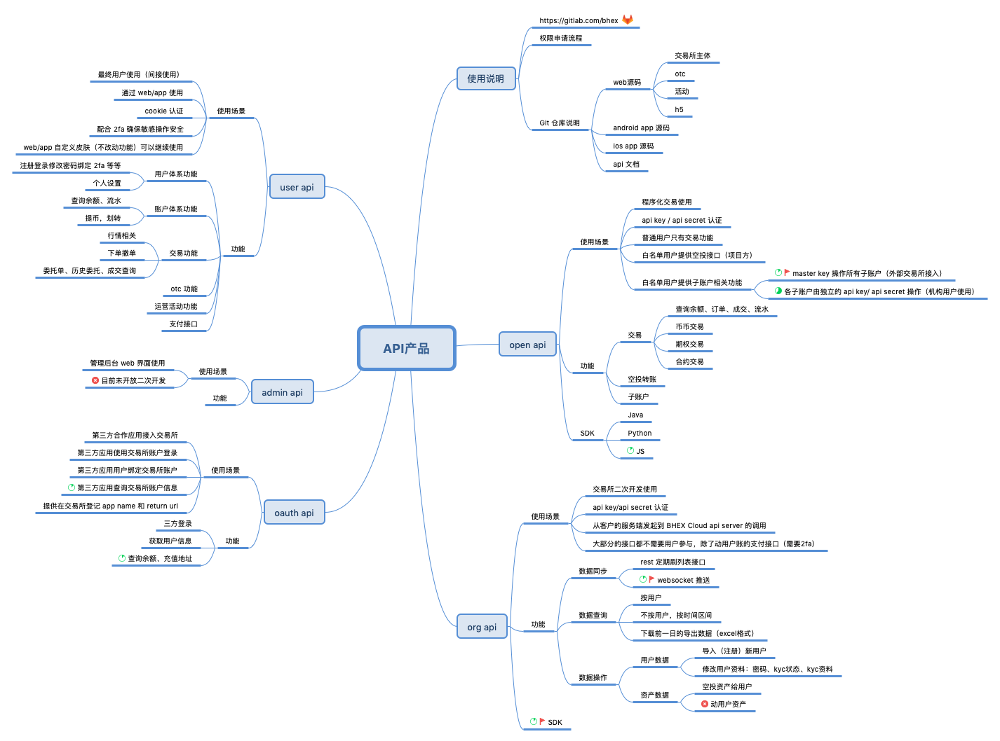
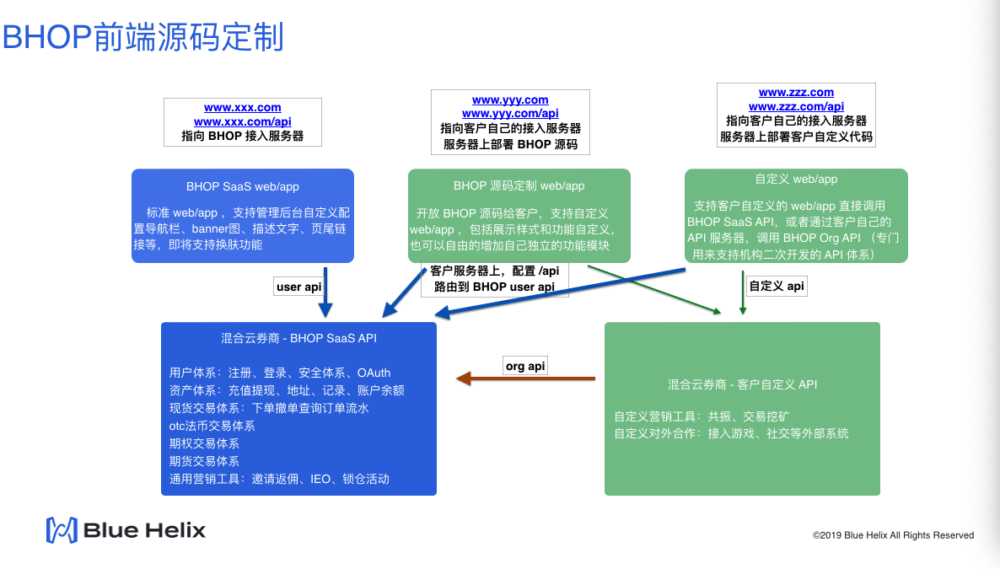
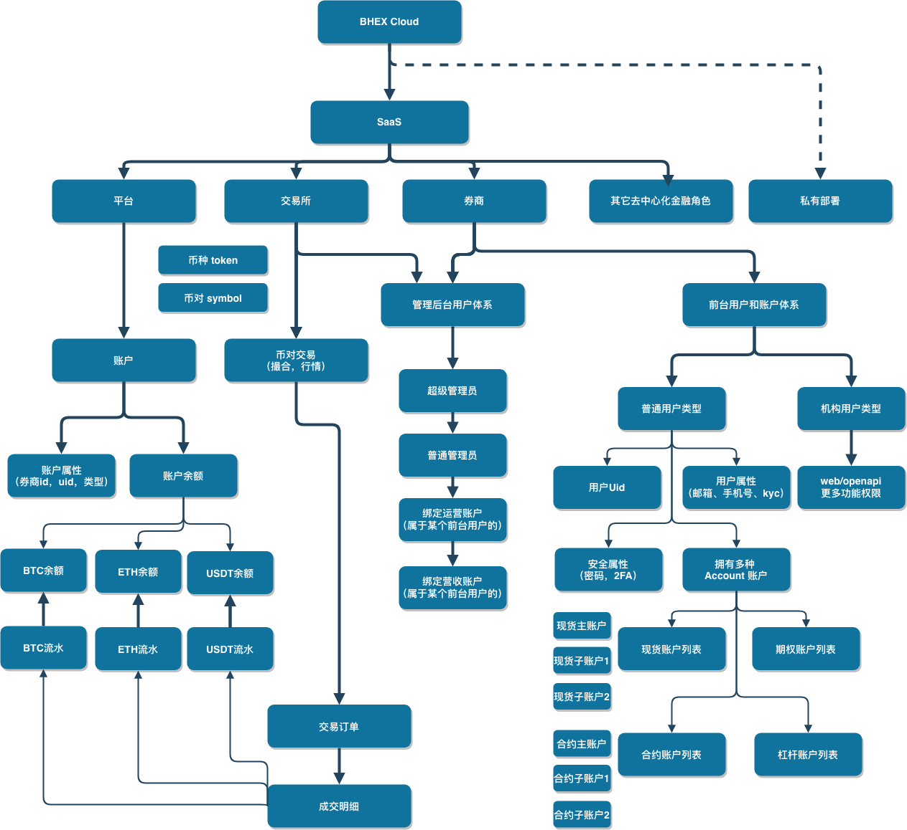

# BHOP Broker API

## 说明

BHOP Broker API 是 "Bluehelix 券商-交易所-托管清算平台"三级体系里，券商端的 API 子系统。

Bluehelix 券商端包括：BHOP SaaS 券商实现（web/app/API/管理后台）；BOMS 券商实现；自定义券商实现 三种实现模式。本文档描述的是第一种 BHOP SaaS 券商实现中的 API 部分。

BHOP Broker API 包括 Rest API 和 Websocket API 两种格式。Rest API 仅支持 Get 和 Post 操作，不支持 Restful 协议中定义的其它操作（如 head，patch，put，delete 等）。Websocket API 主要用于消息推送，暂时不支持下单撤单等业务操作方法。

## 接口分类 // start

BHOP Broker API 由以下五部分组成



### 一、User API

用户端 API，提供给 C 端用户的 web/app 使用

* [BHOP Broker Web/App API 文档](UserAPI/)

提供给券商门户网站和app使用。包括：

* 基于 cookie 的登录认证授权体系
* 用户相关功能：注册登录，绑定邮箱手机GA，找回密码，开通openapi等
* 账户资产相关：查询余额，充值提现，账户流水
* 交易相关：下单撤单，订单状态推送，查询订单、成交等

包括 Rest API 和 Websocket 推送两种形式。

简单的 web 或 app 展示层二次开发（修改 web/app 的样式，配色，功能摆放位置等），可以基于这套 api 实现。

### 二、User OpenAPI

* [BHOP Broker OpenAPI 文档](openapi/)

提供程序化交易使用。包括：

* 基于 api key 和 api secret 的认证授权体系
* 账户资产相关功能
* 交易相关功能
* Java/Python SDK

主要供做市程序、量化交易等使用。

建议客户操作：

* fork 上面的 github 仓库
* 修改仓库中所有的 bhex.com 字样，修改为自己的域名（子域名 api、ws 保持不变）
* 建一个自己的 github 仓库，上传修改过的文档和 sdk
* 将自己的 github 仓库地址配置到券商网站的页脚导航里

### 三、Admin API

Admin API 暂时不支持二次开发。

### 四、OAuth API

* [BHOP Broker OAuth2.0 API 文档](OAuthAPI/oauth_api.md)

提供给券商客户以外的第三方开发使用。第三方 app 或 web 网站可以在用户明确授权后，以用户的身份向券商发起 API 调用，在第三方 app/web 上完成各种功能。包括

* 基于 OAuth 2.0 的用户登录授权体系
* 获取用户信息：邮箱，手机号
* 获取账户信息：余额，各种币的充值地址，账户变动流水
* 获取交易信息：委托单（未完成订单），已完成订单，成交明细
* 交易：下单、撤单
* 频率限制：单个 token 每秒请求 2 次

以上每一种功能，第三方 app/web 在使用前，都需要用户单独授权。

OAuth API 开发测试环境 Sandbox 地址： // todo

### 五、Orgnization API

* [BHOP Broker Orgnization API 文档](OrgAPI/)

简称 Org API（机构API），提供券商二次开发能力的机构 API 。这套 API 将券商核心能力都以 API 形式对外提供，客户可以在这套 API 的基础上，自己实现自己的独特业务逻辑。

Org API 开发测试环境 Sandbox 地址： // todo

#### 1）券商二次开发时的推荐做法

* 以 BHOP 券商为主体：在 BHOP 券商 web 前端的导航栏添加二次开发系统的入口链接。二次开发系统的 web 和后端 api 由单独的二级域名提供，部署在独立的服务器上。二次开发的后端 api 跟 BHOP Org API 通讯。二次开发的前端 web/app 可以根据情况选择直接跟 BHOP User api 通讯，或者跟二次开发后端 api 通讯。
* 以二次开发的独立系统为主体：二次开发的 web/app 直接跟二次开发的后端 api 通讯。二次开发的后端 api 跟 BHOP Org API 通讯。



#### 2）Org API 功能包括

* 基于 api key 和 api secret 的认证授权体系（目前 V2 版本直接复用运营账户的 open api 的 api key 和 api secret 加 ip 白名单，后面可能会单独实现）
* 券商相关功能：获取券商支持的币列表，币对列表及配置信息
* 用户相关功能：注册新用户，更新用户信息，获取用户信息（邀请关系），冻结解冻用户登录权限，审核通过/不通过用户的kyc申请
* 账户相关功能：查询用户账户余额，查询用户充值地址，查询用户账户流水，冻结、解冻用户账户
* 交易相关功能：以指定用户身份下单、撤单，查询订单、成交，冻结、解冻指定用户在指定币对的下单权限
* 财务相关功能：空投，锁仓、解锁，闪兑（映射）。运营账户余额，分佣账户佣金到账记录，待支付账单列表
* 数据同步：Org API 提供消息通知机制，将 BHOP 券商这边系统内的用户行为以消息形式通知给外部，供外部开发使用
  * 用户消息：用户注册，用户登录，用户发起kyc申请，用户发起修改密码等
  * 账户消息：用户充值入账，用户发起提币
  * 交易消息：订单成交。下单撤单数量较大，如果需要消息，则需要按消息数量单独付费。
  * 财务消息：用户被空投到账，用户锁仓、解锁，用户被闪兑。分佣到账，收到新账单

#### 3）接口列表

行情信息相关接口不涉及用户身份，也就不涉及认证操作，所以直接使用 User API 或者 User OpenAPI 即可。

[OrgAPI接口列表](OrgAPI/org_api.md)

#### 4）消息通知

Org API 提供消息通知机制，将 BHOP 券商这边系统内的用户行为以消息形式通知给外部，供外部开发使用

消息通知以 Websocket 方式提供。(待定：是否需要提供 Rest long pulling 方式的 api？)

[OrgAPI消息推送](OrgAPI/websocket.md)

#### 5）Org API 由于权限很大，所以会有对应的风险控制要求

* 二次开发方负责妥善管理 api key 和 api secret。如果因泄露导致财产损失 BHOP 不负任何责任
* 二次开发方负责保证仅操作隶属于自己券商的用户。一旦发现有尝试操作不属于自己用户的行为，BHOP 会立即冻结该 api key 和 api secret 的所有操作权限（特别注意的点：当有一笔成交通知过来的时候，对手订单可能不属于自己券商，所以不能直接去获取对手订单的信息）

## 接口分类结束 // end

## 接口设计原则

### 1) 上行操作幂等原则

所有上行操作，包括不限于下单，撤单，发起提现，注册用户，更新用户信息，冻结解冻用户等，都由发起方提供"唯一操作id" (client_order_id)。BHOP 平台保证同一个"唯一操作id"的请求可以安全的重试，不会有任何副作用。

### 2) 批量操作处理原则

//todo

### 3) 组合操作处理原则

//todo

### 4) 翻页操作原则

Org API 接口不支持 page + num 翻页，只支持 “下一页” “上一页” 模式的翻页。通过 from_id to_id 字段实现。

下一页获取方式：将当前页的最后一条记录的 id ，作为下一页请求的 from_id 或 to_id (根据排序方式不同进行选择)，调用接口即可

### 5) 翻页获取数据操作原则

* 必须指定时间范围，时间范围不能大于 12 小时。一般建议范围为 10 分钟到 30 分钟
* 为了避免平台内部数据同步特殊情况下延时导致的业务错误，准实时同步数据，建议 delay 10 分钟。建议的模式：每 10 分钟调用一轮接口获取数据，12点的时候去获取 11点40 到 11点50 的数据。获取数据的时候指定时间范围，然后翻页，把这一段时间的数据都拿到
* 更及时的获取数据需求，请使用 websocket 同步模式

### 6) 轮询接口操作原则

* 轮询接口的频率需要控制在合理范围

## 接口公共参数和返回格式

业务模型类、统一返回格式和错误码体系

### 1）通用字典枚举定义

// TODO

### 2）通用对象

// TODO

### 3) model 对象之间关系

#### 3.1）业务全景流程



* 平台钱包支持币
* 交易所上币（可配置：合作券商必须同步上，或者由券商自己选择上或不上）
* 交易所上币对（可配置：合作券商必须同步上，或者由券商自己选择上或不上）
* 券商选择交易所的币
* 券商选择交易所的币对
* 用户在券商注册，登录，kyc，开通api（可选）
* 用户在券商充值，或券商管理员空投，使得用户产生余额
* 用户选择币对进行交易，获取差价收益
* 用户选择币进行锁仓，获取收益
* 用户提币

#### 3.2）对象关系 //todo use puml 画图

* 托管平台 has account
* 托管平台 has token
* 托管平台 has org （broker， exchange）
* exchange has token
* exchange has symbol
* broker has relation with exchange
* broker has exchange's token
* broker has exchange's symbol
* broker has user
* user has account
* account has balance
* account has order
* order has trade detail
* order changes balance
* order with symbol
* order with token (airdrop)
* order with 2 tokens, but not symbol (mapping,convert)

### 4) 返回格式

#### 4.1) 正常返回

// todo: fixme

* HTTP STATUS = 200
* 业务正常结果输出
* JSON格式，例如：Login success

```javascript
  {
    "user": {
       // ......
    },
    "token": "......"
  }
```

#### 4.2) 异常返回

// todo: fixme

* HTTP STATUS = 500
* 内部服务器错误
* JSON格式，例如：Internal server error

```javascript
    {
      "code": 110,
      "msg": "Internal server error"
    }
```

* HTTP STATUS = 400
* 业务异常结果输出
* JSON格式，例如：Username or password is incorrect

```javascript
    {
      "code": 1105,
      "msg": "Username or password is incorrect"
    }
```

### 5) 错误码

// todo: fixme

## 权限和费用

### 1) 权限

* 普通客户在试用 BHOP 券商阶段，提供 web/app/openapi/管理后台 供体验
* 客户付费后，提供 web/app 源码供展示层二次开发
* 客户单独申请获得同意后，提供 OAuth API 供第三方开发者接入客户在 BHOP 的券商系统
* 客户单独申请获得同意后，提供 Org API 供客户二次开发使用

### 2) 费用

// TODO
