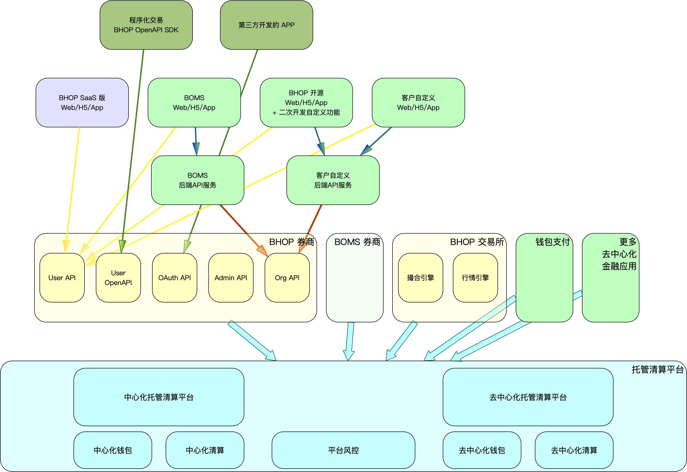

# BlueHelix DeFi Market

## 一、介绍

BlueHelix DeFi Market ，是基于 BlueHelix 去中心化托管平台基础上的，面向去中心化金融业务的应用市场。

目前应用市场提供：

- BHOP 混合云交易所和券商 SaaS
- BOMS 专业券商 SaaS
- 基于 BHOP 上的 OAuth 第三方 APP/Web 接入
- 基于 BHOP 上的 Org API 二次开发

## 二、DeFi 整体架构

## 三、DeFi 合作模式

### 1）SaaS 模式混合云交易所和券商

提供一键开交易所/券商，快速启动业务

### 2）混合云交易所和券商：独立部署 web

自定义品牌视觉效果

### 3）混合云交易所和券商：独立部署 web ，二次开发自定义功能模块

增加自定义的功能模块

二次开发功能模块示例

- 自定义返佣：多级邀请关系，自定义阶梯返佣规则
- 交易挖矿：每日按自定义规则返还交易手续费，返还币种可以是手续费收取的币，也可以是平台币
- 自定义规则的IEO：多期、参与条件、购买后锁定、自定义解锁过程
- 自定义规则的运营活动：锁仓派息，投票上币等等
- 社区化交易所：打通交易所跟社区、游戏等外部系统的用户和资产数据

### 4）完全独立部署BHOP券商

独立部署前台web，后端api，独立db

### 5）完全独立开发的券商：完全自定义券商功能

样例：BOMS

### 6）OAuth 第三方开发者

第三方开发的 APP 或 web 接入合作券商

### 7）已有系统迁移到 BHOP ：迁移用户和资产

标准迁移步骤

- 导入用户：导入手机号和/或 email，不导入密码。引导用户走找回密码流程
- 导入资产：
  - 管理员注册一个前台普通账户，在管理后台绑定为“运营账户”
  - 向运营账户充值
  - 向导入的普通用户空投资产
  - 暂时不支持导入交易和充提币流水，以及订单成交记录

### 8）跟已有系统打通，同时提供服务

场景：客户已经有现有系统，且计划持续运作，想使用 BHOP 系统的部分功能，比如托管清算，币币交易，期权期货等

标准打通用户和资产的方案

- 用户打通
  - 用户在客户系统注册，客户系统调用 BHOP Org API 注册接口，同步在 BHOP 系统注册。客户系统保存 BHOP 返回的用户 uid 和 account id ，及跟客户系统用户的关联关系。
  - 用户在客户系统 KYC，调用 Org API 同步在 BHOP 系统登记 KYC 资料
  - 用户在客户系统登录，调用 Org API 同步在 BHOP 登录，并返回 BHOP 的 cookie 给 web/app
- 资产划转
  - 客户在 BHOP 管理后台绑定运营账户，并提前向运营账户充币
  - 在客户系统中增加一个“资产划转”功能
  - 用户执行“资产划转”时，在客户系统中扣减余额；在 BHOP 系统中，调用接口从运营账户向用户 account 空投转账
  - 用户执行反向的资产划转时，在客户系统中增加余额；在 BHOP 系统中，调用接口操作用户 account 向运营账户空投转账
- 交易操作
  - 在 BHOP 系统中，使用用户的 account 中的余额进行正常的交易

## 四、BHOP混合云交易所部署方式选择和对应服务器部署成本计算

