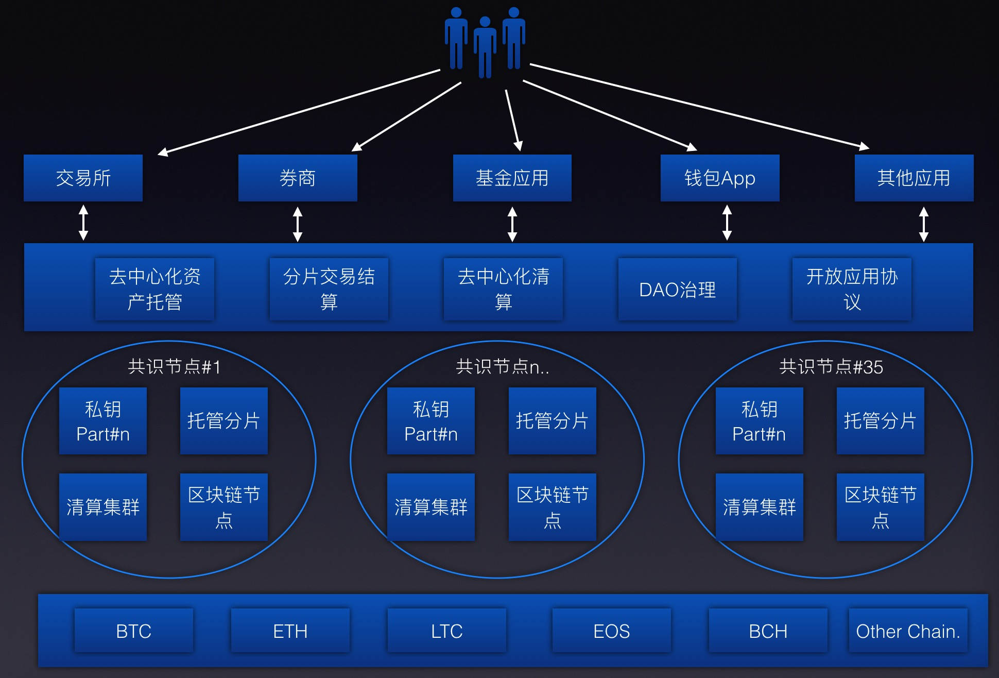
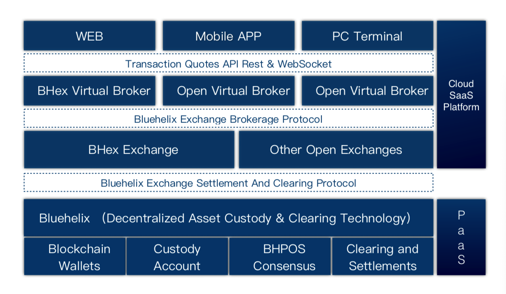
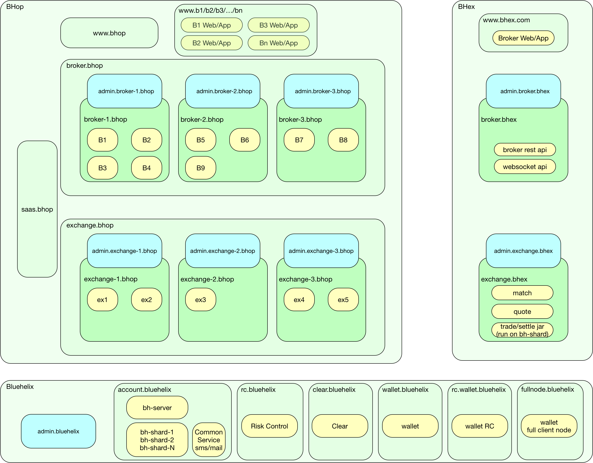
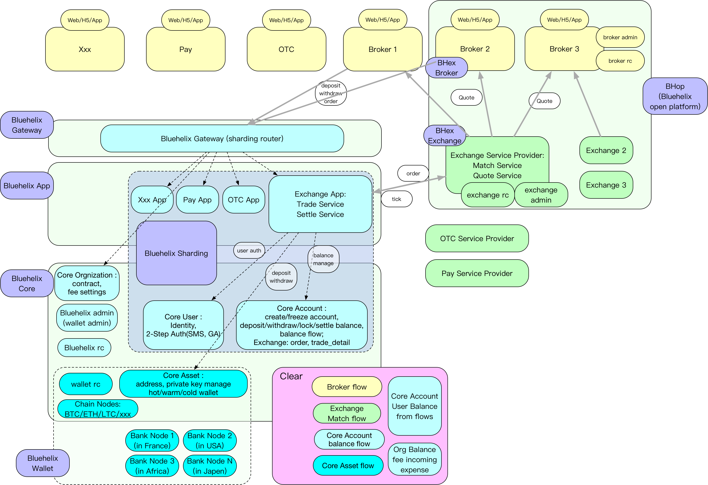
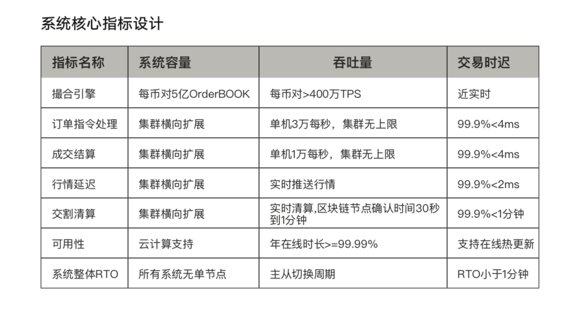
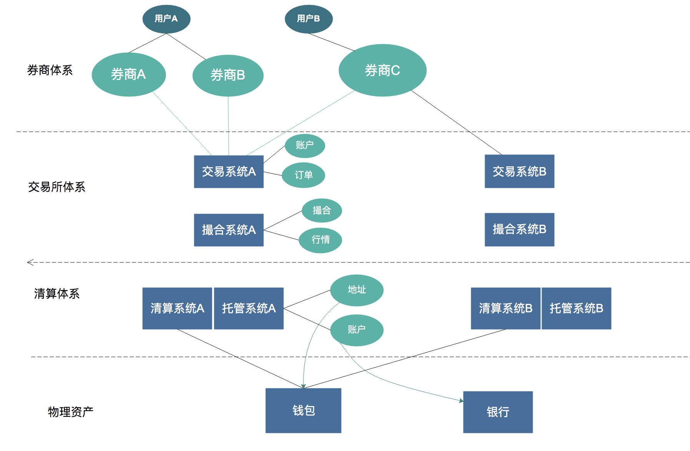
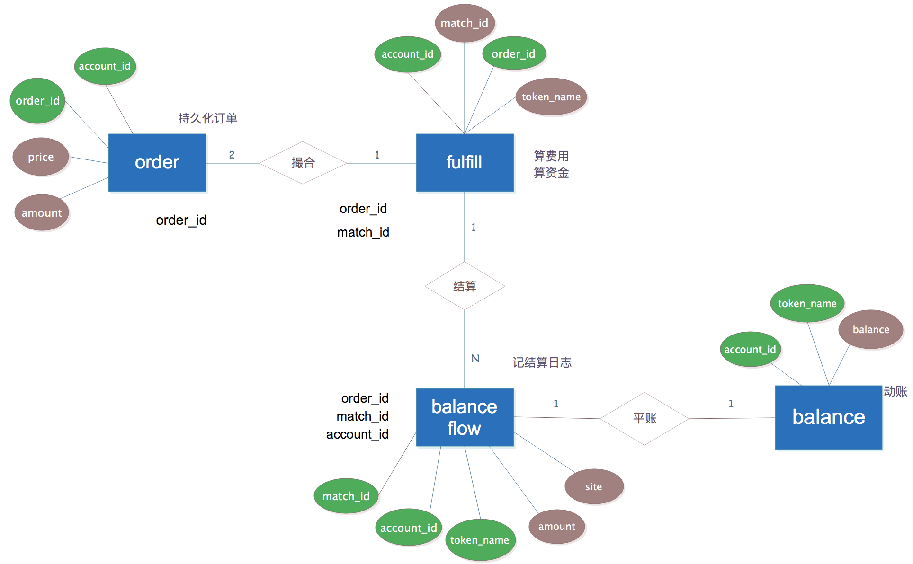

# Bluehelix 生态

---

## 一、Bluehelix 是什么

  一种基于私钥托管的去中心化跨链交易区块链

- 为了金融交易的效率，交易时，只操作数据库中的账目；

- 为了确保数据库中的账目操作之后，后面的实际资产能交割结算，数字货币资产的私钥必须托管，不能放在个人手里；

- 为了保障私钥托管的安全和信任，托管的私钥不能由某一个机构实体持有，平台也不行，必须拆开由多个机构分别持有部分，达成共识后才能动用实际资产

- 为了保障数据库中账目操作的公平公正，需要定期清算对账，清算结果上链

- 这样的一群金融机构共同管理托管私钥，共同定期清算，形成一个去中心化自治组织 DAO （类似国际清算协会 SWIFT）

- 在这个 DAO 提供的数字货币托管清算基础设施的基础上，可以支撑多种金融业务。我们现在做的是第一个业务：交易所业务

## 二、商业实体模型

- Bluehelix 托管清算平台

    Bluehelix 是一种技术，一种协议。它包括了最核心的 wallet（管钱）account（管账）rc（风控）clear（清算）功能模块，以及最重要的清算链，用来记录每次清算的结果。经过清算平账后的每一笔交易指令，被超过 2/3 的 Bluehelix 自治协会（DAO 组织）的会员节点签名后，被记录在清算链上，正式生效

- Bluehelix Open Platform (BHop) 开放交易平台

    BHop 是建立在 Bluehelix 技术基础上的一个 SaaS 平台，提供云服务：一键开通属于你自己的交易所，或者券商。BHop 里面提供了 2 层业务逻辑的实现：底层是交易所和券商的功能实现，面向 C 端最终用户的使用，交易所功能包括 Match（撮合引擎）和 Quote（行情计算引擎），券商功能包括前端 Web 和 App，以及后端 Rest API 和 WebSocket API；在功能实现的上层是一个 SaaS 管理后台，面向 B 端机构用户，提供机构用户的注册、认证、合同签署、分账，一键开通交易所、券商，以及交易所、券商的业务管理后台（如发币，上币，开通新交易币对）等功能。

- wallex 我们的自营交易所和券商

   wallex 是我们自己运营的交易所和券商的品牌。wallex 是 BHop 的一个大客户，使用 BHop 的技术基础设施和代码功能实现。

## 三、部署示意图

## 四、架构设计

## 五、详细设计

## 六、系统设计性能指标

## 七、概念模型

## 八、数据模型：

