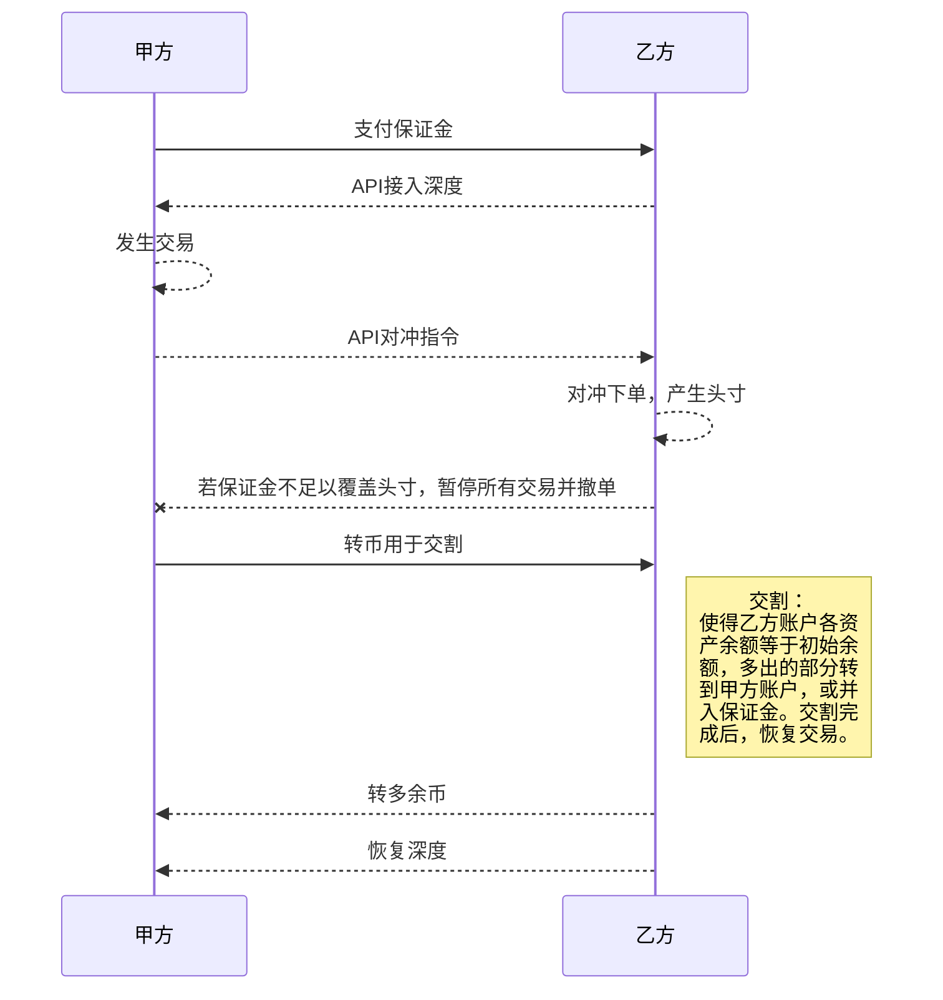

# 币核云主流币流动性服务产品介绍

## 零、服务对象

- 非 bhex cloud 交易所，无法直接使用 bhex cloud 底层流动性共享方案
- bhex cloud 交易所客户，因为某些原因不能直接使用 bhex cloud 底层流动性共享方案

## 一、服务的价值和意义

  - 获得一线交易所的流动性
  - 质押少量保证金，就可获得保证金金额上百倍的深度；
  - 不承担价格波动，不用为了做市而持有大量数字货币；

## 二、服务模式

甲方：客户交易所
乙方：币核云

甲方委托乙方通过 api 接入甲方账户以在其平台挂单提供深度，并向乙方质押一笔保证金以完成服务期间的交割。对于服务期间的每一笔成交，乙方会在乙方平台的专用账户做一笔反向交易，以完全对冲头寸，使资产免于价格风险。在此期间乙方的对冲下单需要支付手续费，乙方会提供优惠费率。交易当时不支付手续费，手续费每日结算一次，从保证金扣除。

 > 具体流程如下图：

## 三、资金要求

 - 保证金：甲方质押给乙方，至少能够覆盖一个交易日所累积的平均交易头寸；
 - 甲方账户资金：甲方提供，资金量决定了深度，完全由甲方控制；
 - 乙方账户资金：乙方提供，金额为保证金的10倍。

## 四、费率要求

  - 甲方账户：甲方应为其账户配置0费率；
  - 乙方账户：乙方提供 0.06% 费率。手续费按日结算，提供明细，从保证金扣除。

## 五、保证金和交割制度

  - 保证金：保证金用于保证乙方为甲方提供主流币流动性服务期间不承担任何头寸的市场风险，若甲方不能及时完成交割，乙方有权使用保证金进行清算；乙方账户因交易产生的手续费，每日结算一次从保证金扣除；保证金不足时，需要追加保证金。
  - 交割：乙方为甲方提供主流币流动性服务期间，每当乙方要求或当乙方账户余额相对初始资金的亏损超过保证金价值的 60% 时，甲方需要与乙方进行交割，使得交割后乙方不持有任何头寸，即每次交割完成后，乙方账户各资产余额应等于初始余额。

    > 交割时，甲方应先向乙方账户充入资产，使得乙方账户各资产余额大于等于初始余额，然后乙方将超过初始余额的部分转给甲方，或者并入保证金。

    > 若甲方不能及时履行交割义务，乙方有权在头寸超过保证金价值的 80% 之后，使用保证金交割，并暂停所有交易。

## 六、风险责任

理论上，本服务使得甲方免于任何市场风险的影响，但若由于以下情况而导致不完全对冲造成损失的，乙方不承担任何责任：
 1. 因网络原因造成对冲失败而导致的损失；
 2. 因甲方交易所技术原因造成对冲失败而导致的损失；
 3. 因甲方交割不及时而导致的损失；
 4. 因甲方保证金不足而导致的损失。

## 七、做市利润分配

每一段时间后，在扣除掉所有手续费之后如果产生做市利润，应按双方事先约定的方式分配利润。甲方应向乙方提供这一期间的所有充提记录、交易记录、手续费记录以计算利润。

## 八、技术要求
 1. 下单、撤单接口支持单个账号每秒 50 单或以上的挂单撤单请求
 2. 下单、撤单接口支持使用client order id
 3. 按币对查询账户当前所有的挂单
 4. websocket 推送账户的逐笔成交信息，且需标记是否为自成交
